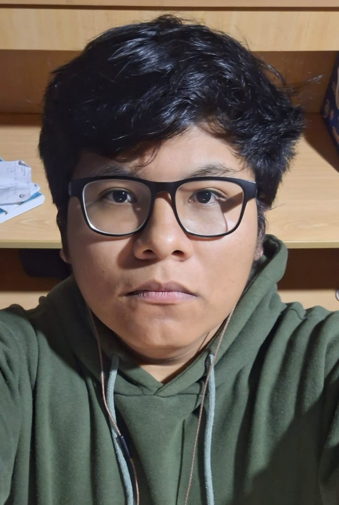
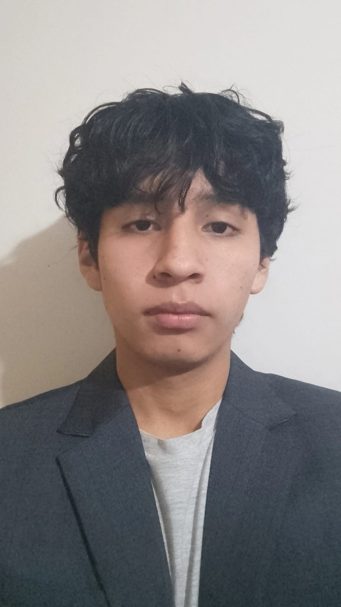

# Capítulo 1: Introducción

La introducción cumple con un rol fundamental para estructurar y comprender el proyecto
realizado, debido a que establece el marco conceptual y contextual donde se va a desarrollar
el trabajo. En esta sección, se presenta una vista general que permite al lector
comprender los objetivos principales que se desean alcanzar, tales como antecedentes que
derivaron a la formulación del proyecto. Además, se delimita el alcance del mismo, es decir,
hasta dónde se pretende llegar con el desarrollo de la propuesta. Asimismo, la introducción
cumple la función de poner en contexto la importancia del proyecto en un entorno específico,
donde se destacan las razones que justifican el porqué de su desarrollo, los retos que se  
pretenden abordar y los beneficios esperados a partir de la implementación. Por último, esta parte
inicial no solo informa, sino que también orienta y motiva al lector a profundizar en el contenido
que se presentará a lo largo del documento.

## 1.1. Startup Profile
El perfil de la startup es un elemento fundamental para comprender su identidad y camino estratégico . A través de este perfil, se revela su visión de futuro, sus valores esenciales y la propuesta de valor que la diferencia en el mercado competitivo.

En esta sección se describen los aspectos que definen a la startup, incluyendo el origen, motivaciones que llevaron a su creación, el problema que busca solucionar y el enfoque innovador que emplea para posicionarse frente a sus competidores.

Además, se analizan los objetivos a mediano y largo plazo, junto con las estrategias diseñadas para su crecimiento y consolidación dentro del sector. Entender estos elementos resulta vital para evaluar el potencial de la startup y el impacto que puede generar en su entorno.

### 1.1.1. Descripción de la Startup
La startup IngesCompany se centra en el desarrollo de soluciones tecnológicas innovadoras que buscan optimizar procesos y mejorar la eficiencia en diversos sectores, en este caso, el enfoque es la regulación de las máquinas donde se realizan la fabricación de los fármacos, incluyendo una supervición de la calidad de dichos fármacos producidos.

El propósito es brindar una plataforma que combine la solidez de una arquitectura de software empresarial con la innovación del Internet de las Cosas (IoT), que permita a las instituciones farmacéuticas cumplir con las Buenas Prácticas de Manufactura (BPM) exigidas por entidades como la Dirección General de Medicamentos, Insumos y Drogas (DIGEMID).

Como principales características que nos ayudan a diferenciar de la competencia, se destacan la integración de sensores IoT para monitoreo en tiempo real, el control de "Cuarentena y Liberación", estados virtuales de los fármacos para la revisión de calidad, y la trazabilidad de Extremo a Extremo, que permite la visualización completa de la información de los fármacos desde su fabricación hasta su distribución, garantizando la seguridad y cumplimiento de los estándares regulatorios.

### **Misión**
La misión de IngesCompany es proporcionar soluciones tecnológicas avanzadas que optimicen los procesos de fabricación farmacéutica, asegurando la calidad y seguridad de los productos, cumpliendo con las regulaciones vigentes y contribuyendo al bienestar de la sociedad.

### **Visión**
La visión de IngesCompany es convertirse en un referente global en la implementación de tecnologías innovadoras para la industria farmacéutica en Lima, liderando la transformación digital del sector y promoviendo la excelencia en la producción de medicamentos.

### 1.1.2 Perfiles de Integrantes del Equipo

|                         Foto                         |                                Detalles del Perfil                                 |                                                                                    Descripción Personal                                                                                    |
|:----------------------------------------------------:|:----------------------------------------------------------------------------------:|:------------------------------------------------------------------------------------------------------------------------------------------------------------------------------------------:|
|    |   Marcelo Martín Angulo Ramírez   (U202321425)   Ingeniería de Software.   | Tengo 21 años y soy una persona puntual, responsable y comunicativa. Me interesé por la carrera gracias a cursos de programación del colegio y a los que tomé por mi cuenta; actualmente manejo C++ y Python, y busco ampliar mis conocimientos en otros lenguajes para optimizar mi trabajo en equipo y resolver problemas. |
|   |    Cobades Zamora Yhoshua Hebert   (U20231H117)   Ingeniería de Software.    | Tengo 19 años, me interesa mucho aprender sobre tecnología y soy bastante resistente al estrés. En mis tiempos libres me gusta aprender e informarme sobre la situación actual de varias tecnologías. Me divierto surfeando en las olas de internet. I use Arch btw. |
|    |  Flores Martinez Ricardo Andres   (U202423162)   Ingeniería de Software.   | Tengo 19 años y soy una persona responsable, organizada y comprometida. Me interesa mucho la tecnología, especialmente el desarrollo de software y la creación de aplicaciones. Mi interés por la programación fue gracias a mi familia, lo que me llevó a elegir Ingeniería de Software. Actualmente cuento con conocimientos en programación, bases de datos y desarrollo de proyectos, y busco constantemente aprender nuevas herramientas y tecnologías |
|      |    Nestor Daniel Rojas Ambicho   (U20241F397)   Ingeniería de Software.    | Tengo 20 años, apasionado por la tecnología, el desarrollo de aplicaciones y la programación. Con experiencia en proyectos académicos de software, bases de datos y metodologías de desarrollo, busco constantemente aprender y dominar nuevas herramientas técnicas. Me interesé por la carrera debido a que desde el colegio me gustaban cursos relacionados a la tecnologia, y después empecé a aprender por mi cuenta. |
|  | Rodolfo Martin Zavaleta Gutierrez   (U20241F733)   Ingeniería de Software. | Tengo 19 años y soy una persona puntual y responsable. Me interesé por la carrera debido a mis gustos adquiridos por la programación gracias a cursos del colegio y que tomé por mi parte. |  

## 1.2. Solution Profile

### 1.2.1. Antecedentes y problemática

**1. ANTECEDENTES:**

**2. PROBLEMATICA:**

**A:**

**B:**

**C:**

**ANALISIS 5W & 2H:**

- **What (¿Qué?):** ¿Qué es lo que se busca resolver?

- **Why (¿Por qué?):** ¿Por qué es importante resolverlo?

- **Who (¿Quién?):** ¿A quién afecta?

- **When (¿Cuándo?):** ¿Cuándo ocurre?

- **Where (¿Dónde?):** ¿En dónde ocurre?

- **How (¿Cómo?):** ¿Cómo se resuelve?

- **How much (¿Cuánto?):** ¿Cuánto cuesta resolverlo?

### 1.2.2. Lean UX Process

El Lean UX es un enfoque que permite validar las soluciones propuestas para los problemas identificados. Este método se centra en los usuarios del producto. Una vez definido el problema a resolver, se aplicó este procedimiento para determinar los aspectos clave que guiarán el desarrollo del producto.

#### 1.2.2.1. Lean UX Problem Statements

**The current state of** pharmaceutical quality control in Peru **has focused mainly on** manual record keeping and fragmented information systems, forcing quality assurance pharmacists and pharmacy directors to invest excessive time in data consolidation for regulatory audits, increasing the risk of human error, and delaying the detection of operational deviations.

**What existing products fail to address is** the need for an affordable, scalable platform that unifies real time machine monitoring, automated quality verification, and full traceability from production to storage while remaining accessible to mid sized laboratories and public health institutions.

**Our product will address this gap by** delivering a SaaS solution that integrates IoT based sensor data, automated quarantine and release workflows, and complete batch genealogy, enabling proactive quality management and streamlined regulatory compliance.

**Our initial focus will be** on pharmacy directors and quality assurance pharmacists within mid sized pharmaceutical laboratories and public health entities in Peru.

**We will know we have succeeded when we see** a significant decrease in manual registration errors, a measurable reduction in audit preparation time, and sustained improvements in quality and traceability performance metrics among our early adopters.

#### 1.2.2.2. Lean UX Assumptions

En esta sección se presentan las premisas que sustentan la propuesta de DoofPlus, tomando en cuenta el marco regulatorio de la DIGEMID, las limitaciones de los procesos manuales en los laboratorios y el valor que aporta una plataforma integral de monitoreo y trazabilidad.

**Business Assumptions:**

*

**Business Outcome Assumptions:**

*

**User Assumptions:**

*

**User Outcome & Benefit Assumptions:**

*

**Feature Assumptions:**

*

#### 1.2.2.3. Lean UX Hypothesis Statements

* **Hypothesis 1:**
* **Hypothesis 2:**
* **Hypothesis 3:**
* **Hypothesis 4:**
* **Hypothesis 5:**

#### 1.2.2.4. Lean UX Canvas

## 1.3. Segmentos objetivo

Características demográficas:

- **Edad:**
- **Género:**
- **Ocupación:**
- **Nivel educativo:**
- **Ubicación geográfica:**

Información estadística de sustento:

-

### Segmento Objetivo 2:

Características demográficas:

- **Edad:**
- **Género:**
- **Ocupación:**
- **Nivel educativo:**
- **Ubicación geográfica:**

Información estadística de sustento:

-
