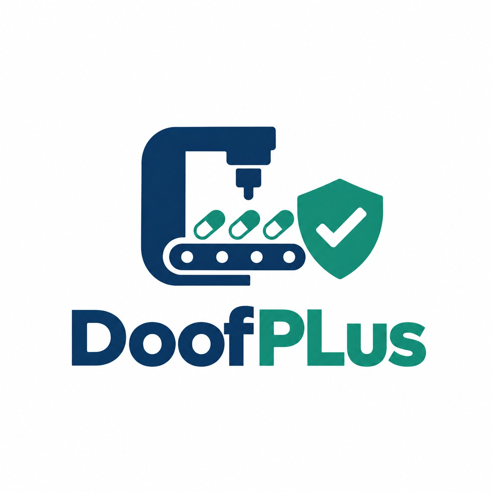
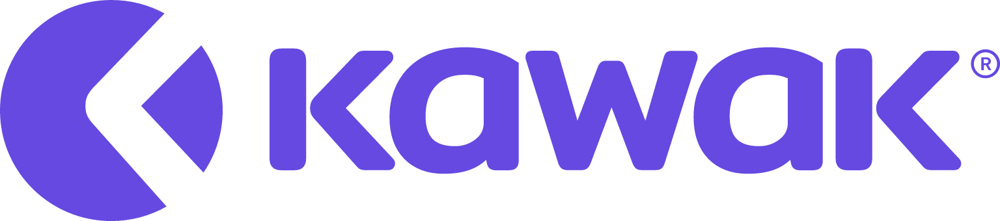

# Capítulo II: Requirements Elicitation & Analysis

## 2.1. Competidores

En el mercado de soluciones digitales orientadas a la gestión de calidad farmacéutica y la trazabilidad de lotes, es posible identificar diversas plataformas que abordan, total o parcialmente, las problemáticas que DoofPlus busca resolver. El análisis de estos competidores permite comprender el panorama competitivo, evaluar las fortalezas y debilidades de las alternativas existentes, e identificar oportunidades de diferenciación para la propuesta desarrollada. A continuación, se presenta el análisis competitivo y las estrategias definidas frente a los principales competidores identificados.

### 2.1.1. Análisis competitivo

Para el análisis competitivo se identificaron tres competidores representativos que operan en distintos segmentos del mercado de gestión de calidad farmacéutica: **MasterControl**, como solución empresarial global líder; **Veeva Vault Quality**, como plataforma especializada en ciencias de la vida; y **KAWAK**, como solución regional latinoamericana de gestión de calidad. A continuación, se presenta la tabla comparativa:

|                          | DoofPlus                                                                                                                                                                                                    | MasterControl                                                                                                                                                                               | Veeva Vault Quality                                                                                                                                                                                       | KAWAK                                                                                                                                                                                        |
|:------------------------:|:------------------------------------------------------------------------------------------------------------------------------------------------------------------------------------------------------------|:--------------------------------------------------------------------------------------------------------------------------------------------------------------------------------------------|:----------------------------------------------------------------------------------------------------------------------------------------------------------------------------------------------------------|:---------------------------------------------------------------------------------------------------------------------------------------------------------------------------------------------|
| **Logo**                 |                                                                                                                                   |                                                                                                         |                                                                                                                                       |                                                                                                                          |
| **Overview**             | Plataforma web open source diseñada para apoyar la gestión de calidad y trazabilidad en la industria farmacéutica peruana, con integración de datos IoT para fortalecer el monitoreo de procesos productivos. | Plataforma empresarial de gestión de calidad y manufactura para industrias reguladas, con capacidades de control documental, registros electrónicos de lotes y cumplimiento regulatorio.     | Suite cloud nativa diseñada exclusivamente para la industria de ciencias de la vida, que unifica gestión de calidad, documentación regulatoria y procesos de cumplimiento en un ecosistema integrado.      | Software de gestión de calidad enfocado en el mercado latinoamericano, con módulos para gestión documental, auditorías, indicadores, planes de acción y cumplimiento de normas ISO.           |
| **Ventaja competitiva**  | Solución open source con integración IoT nativa, enfocada específicamente en el contexto regulatorio peruano (BPM/DIGEMID), con bajo costo de adopción y capacidad de personalización.                       | Amplia trayectoria y reconocimiento global en industrias reguladas, con módulos maduros para control documental, registros de manufactura y validación preconfigurada conforme a FDA/GxP.    | Ecosistema unificado cloud que conecta calidad, regulatorio y clínico en una sola plataforma, con alta escalabilidad y adopción por parte de las principales farmacéuticas globales.                       | Presencia consolidada en Latinoamérica con soporte en español, implementación rápida y enfoque accesible para medianas empresas de la región.                                                |
| **Mercado objetivo**     | Laboratorios y plantas farmacéuticas medianas y pequeñas en el Perú y Latinoamérica que buscan digitalizar sus procesos de calidad y trazabilidad con bajo presupuesto.                                      | Grandes y medianas empresas farmacéuticas, biotecnológicas y de dispositivos médicos a nivel global que requieren soluciones validadas y conformes a estándares internacionales.              | Grandes corporaciones farmacéuticas y de ciencias de la vida a nivel mundial que necesitan una plataforma unificada para gestión de calidad, regulatorio y operaciones clínicas.                           | Empresas medianas y grandes de diversos sectores en Latinoamérica (incluido el farmacéutico) que buscan implementar y mantener sistemas de gestión de calidad basados en normas ISO.          |
| **Estrategias de marketing** | Marketing digital enfocado en contenido educativo sobre transformación digital farmacéutica, comunidad open source, y presencia en eventos del sector salud y tecnología en Perú.                         | Marketing B2B global mediante webinars, whitepapers, conferencias de la industria farmacéutica (ISPE, PDA), y alianzas con consultoras de cumplimiento regulatorio.                          | Estrategia de ecosistema integrado, participación activa en eventos regulatorios globales, alianzas con grandes farmacéuticas, y posicionamiento como estándar de la industria en ciencias de la vida.     | Marketing regional en español, participación en eventos de calidad y gestión empresarial en Latinoamérica, casos de éxito locales y alianzas con consultoras de certificación ISO.            |
| **Productos y servicios** | Plataforma web de gestión de calidad farmacéutica: gestión de protocolos, expedientes de calidad, trazabilidad de lotes, gestión de desviaciones, dashboards operativos e integración con dispositivos IoT. | Quality Excellence (gestión documental, CAPA, auditorías, capacitación), Manufacturing Excellence (registros electrónicos de lotes, revisión por excepción), y módulos de validación y cumplimiento. | Vault QMS (CAPA, desviaciones, cambios, auditorías), Vault QualityDocs (gestión documental regulada), Vault Training (capacitación regulada), integrado con Vault RIM y Vault Clinical.                  | Gestión documental, auditorías internas, indicadores de gestión, planes de acción, gestión de riesgos, CAPA, y módulos de cumplimiento normativo para sistemas ISO y BPM.                    |
| **Precios y costos**     | Open source y gratuito. Los costos asociados corresponden a infraestructura de despliegue (hosting) y personalización según las necesidades de la organización.                                              | Modelo de suscripción por usuario nombrado. Los precios no son públicos; se estiman a partir de USD 25,000/año, pudiendo superar los USD 100,000/año para implementaciones empresariales.    | Modelo de suscripción personalizado con tarifas de entorno base y licencias por usuario nombrado. Los precios no son públicos y se negocian directamente. Requiere inversión significativa.                | Modelo de suscripción SaaS con planes según el número de usuarios y módulos contratados. Precios accesibles para el mercado latinoamericano, con planes desde aproximadamente USD 200/mes.   |
| **Canales de distribución (web y/o móvil)** | Plataforma web responsive accesible desde navegadores modernos en dispositivos de escritorio y móviles.                                                                                    | Plataforma web con aplicación móvil complementaria. Despliegue cloud gestionado por MasterControl.                                                                                          | Plataforma 100% cloud accesible vía web. No requiere instalación local ni infraestructura on-premise.                                                                                                     | Plataforma web SaaS accesible desde navegadores. Despliegue cloud gestionado.                                                                                                                |
| **Fortalezas**           | 1. Código abierto con posibilidad de personalización total. 2. Integración nativa con dispositivos IoT para monitoreo en tiempo real. 3. Bajo costo de adopción. 4. Enfoque específico en el contexto regulatorio farmacéutico peruano (BPM/DIGEMID). 5. Trazabilidad integral del ciclo de vida de lotes. | 1. Solución madura y consolidada en el mercado global. 2. Módulos prevalidados conformes a FDA 21 CFR Part 11. 3. Amplia funcionalidad para manufactura y registros electrónicos de lotes. 4. Soporte técnico global especializado. 5. Gran base de clientes en industrias reguladas. | 1. Plataforma cloud nativa con alta disponibilidad y escalabilidad. 2. Ecosistema unificado que conecta calidad, regulatorio y clínico. 3. Estándar de facto en grandes farmacéuticas globales. 4. Actualizaciones continuas sin intervención del cliente. 5. Integraciones predefinidas con sistemas del sector. | 1. Fuerte presencia y soporte en Latinoamérica. 2. Interfaz y documentación completamente en español. 3. Implementación rápida y sencilla. 4. Precios accesibles para el mercado regional. 5. Experiencia en múltiples normativas de gestión de calidad (ISO, BPM). |
| **Debilidades**          | 1. Producto en fase temprana de desarrollo sin base instalada en producción. 2. Sin validación regulatoria preconfigurada (requiere validación por parte del cliente). 3. Comunidad open source incipiente. 4. Reconocimiento de marca limitado en el mercado. | 1. Costos elevados que lo hacen inaccesible para PYMEs. 2. Implementación compleja y prolongada. 3. Limitada presencia y soporte localizado en Latinoamérica. 4. Sin integración IoT nativa. 5. Curva de aprendizaje significativa. | 1. Costos muy elevados orientados a grandes corporaciones. 2. Complejidad de implementación y configuración. 3. Dependencia total del proveedor (vendor lock-in). 4. Sin integración IoT nativa para monitoreo de procesos. 5. Limitada presencia en el mercado farmacéutico peruano. | 1. No es una solución especializada exclusivamente en la industria farmacéutica. 2. Funcionalidades limitadas para trazabilidad de lotes farmacéuticos. 3. Sin integración con dispositivos IoT. 4. Capacidades limitadas para registros electrónicos de lotes (eBR). 5. Menor profundidad funcional en comparación con soluciones empresariales globales. |

### 2.1.2. Estrategias y tácticas frente a competidores

Con base en el análisis competitivo realizado, se han definido las siguientes estrategias y tácticas que DoofPlus adoptará para posicionarse en el mercado y diferenciarse de los competidores identificados:

#### Estrategias competitivas

1. **Liderazgo en costos mediante modelo open source:**
   DoofPlus adoptará una estrategia de liderazgo en costos aprovechando su naturaleza de código abierto, lo que elimina los costos de licenciamiento que representan una barrera de entrada significativa en las soluciones de la competencia. Mientras que MasterControl y Veeva Vault Quality requieren inversiones anuales que pueden superar los USD 25,000 y USD 100,000 respectivamente, DoofPlus permitirá a las organizaciones acceder a funcionalidades de gestión de calidad farmacéutica sin costos de licencia, asumiendo únicamente los gastos de infraestructura y personalización.

2. **Diferenciación mediante integración IoT nativa:**
   A diferencia de los competidores identificados, DoofPlus incorporará de manera nativa la integración con dispositivos IoT para la captura automática de datos operativos durante los procesos de fabricación. Esta funcionalidad permite fortalecer la confiabilidad de los registros de calidad al complementarlos con información obtenida directamente de sensores y equipos, reduciendo la dependencia de registros manuales y contribuyendo a la integridad de los datos.

3. **Enfoque en el nicho farmacéutico peruano y latinoamericano:**
   Mientras que MasterControl y Veeva Vault Quality están orientados al mercado global con énfasis en regulaciones FDA y EMA, DoofPlus se enfocará específicamente en el contexto regulatorio peruano y latinoamericano, alineándose con las exigencias de DIGEMID y las Buenas Prácticas de Manufactura (BPM) locales. Esta especialización permitirá ofrecer una solución contextualizada y relevante para las organizaciones del sector farmacéutico nacional.

4. **Personalización y flexibilidad tecnológica:**
   El carácter open source de DoofPlus permitirá a las organizaciones adaptar la plataforma a sus necesidades específicas, a diferencia de las soluciones propietarias que imponen flujos de trabajo predefinidos. Esta flexibilidad resulta particularmente valiosa para laboratorios con procesos particulares o requerimientos de integración con sistemas internos existentes.

#### Tácticas específicas

1. **Frente a MasterControl:**
    - Posicionar DoofPlus como la alternativa accesible para laboratorios medianos y pequeños que no pueden asumir los costos de licenciamiento de soluciones empresariales globales.
    - Destacar la integración IoT nativa como valor diferencial frente a la ausencia de esta funcionalidad en MasterControl.
    - Ofrecer documentación y soporte completamente en español, enfocado en el contexto regulatorio latinoamericano, frente a la limitada presencia regional de MasterControl.

2. **Frente a Veeva Vault Quality:**
    - Enfatizar la independencia tecnológica y la ausencia de vendor lock-in que ofrece el modelo open source, en contraste con la dependencia total del ecosistema propietario de Veeva.
    - Dirigirse al segmento de mercado desatendido por Veeva: laboratorios pequeños y medianos en Perú y Latinoamérica que no requieren ni pueden costear una plataforma de alcance global.
    - Resaltar la capacidad de despliegue on-premise como opción para organizaciones con políticas estrictas de soberanía de datos.

3. **Frente a KAWAK:**
    - Diferenciarse mediante la especialización exclusiva en la industria farmacéutica, frente al enfoque generalista de KAWAK que abarca múltiples sectores.
    - Destacar las funcionalidades específicas de trazabilidad de lotes farmacéuticos y registros electrónicos de lotes que KAWAK no ofrece con la misma profundidad.
    - Posicionar la integración IoT como ventaja tecnológica que permite captura automática de datos de procesos productivos, funcionalidad no disponible en KAWAK.

## 2.2. Entrevistas

Las entrevistas constituyen una herramienta fundamental para obtener información cualitativa directamente de los profesionales involucrados en los procesos de aseguramiento de calidad y producción farmacéutica. A través de conversaciones estructuradas, se busca comprender sus actividades, necesidades, desafíos, comportamientos y experiencias relacionadas con la gestión de documentación, la trazabilidad de lotes y el acceso a la información. La información recopilada permitirá identificar problemáticas, oportunidades de mejora y necesidades reales del entorno de aplicación, contribuyendo a definir una propuesta de solución alineada con los requerimientos y expectativas de los segmentos objetivo.

### 2.2.1. Diseño de entrevistas

Teniendo en cuenta la importancia de la información que pueden proporcionar los entrevistados, se presentan las preguntas clave para cada segmento objetivo identificado. Para ello, se consideran dos tipos de preguntas: las personales, orientadas a conocer el perfil profesional y la experiencia de los participantes dentro de la industria farmacéutica, y las específicas, enfocadas en comprender los procesos actuales relacionados con la gestión de calidad, la trazabilidad de lotes, el acceso a la información, la gestión documental y la coordinación entre las áreas de producción y aseguramiento de la calidad. Asimismo, se busca identificar las principales dificultades, necesidades y oportunidades de mejora presentes en sus actividades diarias, con el fin de obtener información relevante para la definición de la propuesta de solución.

#### Segmento Objetivo: Especialista de Aseguramiento y Control de Calidad (QA/QC)

##### Preguntas personales

- ¿Cuál es su nombre?
- ¿Cuál es su edad?
- ¿Que dispositivo y buscador emplea?
- ¿Cuál es su cargo actual dentro de la organización?
- ¿Cuántos años de experiencia tiene trabajando en aseguramiento o control de calidad farmacéutica?

##### Preguntas específicas

- ¿Cómo gestiona actualmente los protocolos, registros y documentación relacionada con la calidad de los productos farmacéuticos?
- ¿Qué tipo de información necesita consultar con mayor frecuencia para realizar sus actividades de aseguramiento o control de calidad?
- ¿Cuáles son las principales dificultades que encuentra al buscar información o documentación relacionada con un lote específico?
- ¿Cómo realiza el seguimiento de desviaciones, incidencias o no conformidades dentro de los procesos de calidad?
- ¿Cuánto tiempo suele dedicar a recopilar información o evidencias para auditorías, inspecciones o revisiones internas?
- ¿Qué problemas ha experimentado relacionados con la trazabilidad de los registros o la disponibilidad de información histórica?
- Si pudiera mejorar una actividad relacionada con la gestión de calidad dentro de su organización, ¿cuál sería y por qué?

#### Segmento Objetivo: Jefe o Supervisor de Producción Farmacéutica

##### Preguntas personales

- ¿Cuál es su nombre?
- ¿Cuál es su edad?
- ¿Que dispositivo y buscador emplea?
- ¿Cuál es su cargo actual dentro de la organización?
- ¿Cuántos años de experiencia tiene supervisando procesos de producción farmacéutica?

##### Preguntas específicas

- ¿Cómo realiza actualmente el seguimiento de los lotes durante las diferentes etapas del proceso de fabricación?
- ¿Qué información considera más importante para supervisar el estado de la producción y tomar decisiones operativas?
- ¿Qué herramientas o sistemas utiliza para consultar información relacionada con la producción?
- Cuando ocurre una incidencia o desviación durante la fabricación, ¿cómo se registra y comunica dicha información?
- ¿Cuáles son las principales dificultades que encuentra al acceder al historial de producción de un lote específico?
- ¿Qué tan sencillo o complejo resulta coordinar el intercambio de información con las áreas de aseguramiento y control de calidad?
- Si pudiera mejorar un aspecto relacionado con el acceso o gestión de la información de producción, ¿qué cambiaría y por qué?

### 2.2.2. Registro de entrevistas

En esta sección se presentan los resultados obtenidos de las entrevistas realizadas a los segmentos objetivo identificados para DoofPlus. Para cada entrevista se incluyen los datos generales del participante, un resumen de las respuestas más relevantes, las observaciones realizadas durante la sesión y las principales conclusiones obtenidas. La información recopilada permite comprender las necesidades, dificultades y experiencias de los profesionales vinculados a los procesos de aseguramiento de calidad y producción farmacéutica, constituyendo una fuente de evidencia para la validación de los supuestos planteados y para la definición de las funcionalidades y características de la solución propuesta.

**Segmento 1: Especialista de Aseguramiento y Control de Calidad (QA/QC)**

### Entrevista #1

| Campo | Información |
|---------|---------|
| Nombre | Mareliena Mexico |
| Edad | 53 |
| Distrito | San Juan de Lurigancho |
| Evidencia |  |
| Link | https://sl1nk.com/klevtn8 |
| Inicio | 00:00 min |
| Duración | 04:38 min |
| Resumen |  |

**Segmento 2: Jefe o Supervisor de Producción Farmacéutica**

| Campo | Información |
|---------|---------|
| Nombre | X |
| Edad | XX |
| Distrito | X |
| Evidencia | X |
| Link | X |
| Inicio | XX:XX min |
| Duración | XX:XX min |
| Resumen |  |

### 2.2.3. Análisis de entrevistas

## 2.3. Needfinding

### 2.3.1. User Personas

### 2.3.2. User Task Matrix

### 2.3.3. User Journey Mapping

### 2.3.4. Empathy Mapping

## 2.4. Big Picture Event Storming

## 2.5. Ubiquitous Language