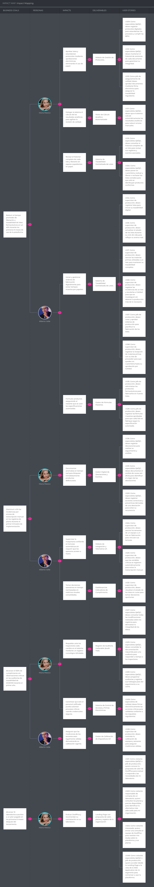

# Capítulo III: Requirements Specification
En este capítulo se presenta los requisitos especìficados de DoofPlus, acorde al análisis de la problemática, los segmentos objetivo y el alcance obtenido durante el desarrollo. La especificación cubre tres productos de la solución: la landing page pública, la aplicación web frontend y los servicios backend RESTful implementados con una arquitectura basada en bounded contexts.

## 3.1. User Stories
| Epic / Story ID | Título | Descripción | Criterios de Aceptación | Relacionado con (Epic ID) |
| :--- | :--- | :--- | :--- | :--- |
| **EP01** | **Landing Page & Public Experience** | Agrupa las funcionalidades públicas que permiten comunicar la propuesta de valor de DoofPlus, captar potenciales clientes y presentar la solución. | - | - |
| US01 | Visualización de la propuesta de valor | Como visitante, quiero conocer los beneficios de DoofPlus para evaluar si la solución responde a las necesidades de mi organización. | **Escenario 1: Carga de beneficios** **Dado que** el visitante entra a la landing page **Cuando** navega hacia la sección principal **Entonces** el sistema muestra la propuesta de valor de forma clara y accesible. | EP01 |
| US02 | Visualización de características del sistema | Como visitante, quiero conocer las funcionalidades principales de DoofPlus para comprender cómo mejora la trazabilidad y la gestión de calidad. | **Escenario 1: Exploración de funcionalidades** **Dado que** el visitante está en la página principal **Cuando** hace clic en "Características" **Entonces** el sistema lista las funcionalidades principales enfocadas en calidad y trazabilidad. | EP01 |
| US03 | Visualización de planes y precios | Como visitante, quiero consultar los planes de adopción disponibles para identificar la alternativa más adecuada para mi organización. | **Escenario 1: Comparativa de planes** **Dado que** el visitante accede a la sección de precios **Cuando** revisa las opciones disponibles **Entonces** visualiza una tabla comparativa con costos y características por plan. | EP01 |
| US04 | Formulario de contacto | Como visitante, quiero enviar una solicitud de contacto para recibir más información sobre la solución. | **Escenario 1: Envío exitoso** **Dado que** el visitante completa los campos obligatorios **Cuando** envía el formulario **Entonces** el sistema registra la solicitud y muestra un mensaje de confirmación. | EP01 |
| US05 | Preguntas frecuentes | Como visitante, quiero consultar preguntas frecuentes para resolver dudas comunes sobre la plataforma. | **Escenario 1: Consulta de FAQ** **Dado que** el visitante tiene dudas operativas **Cuando** expande una pregunta en la sección FAQ **Entonces** el sistema muestra la respuesta correspondiente. | EP01 |
| TS01 | Implementación de Landing Page Responsive | Como Developer, quiero implementar una landing page responsive para garantizar una experiencia adecuada en distintos dispositivos. | **Escenario 1: Adaptación móvil** **Dado que** un usuario accede desde un smartphone **Cuando** carga la página **Entonces** los elementos de la interfaz se ajustan al tamaño de la pantalla. | EP01 |
| **EP02** | **Identity & Access Management** | Gestiona la autenticación, autorización, roles y control de acceso de los usuarios del sistema. | - | - |
| US06 | Inicio de sesión | Como usuario registrado, quiero iniciar sesión para acceder a las funcionalidades del sistema. | **Escenario 1: Credenciales válidas** **Dado que** el usuario ingresa su email y contraseña correctos **Cuando** presiona "Iniciar sesión" **Entonces** accede al panel principal de su cuenta. | EP02 |
| US07 | Gestión de roles | Como administrador, quiero asignar roles y permisos para controlar el acceso a funcionalidades específicas. | **Escenario 1: Cambio de rol** **Dado que** el administrador selecciona a un usuario **Cuando** le asigna el rol de "Especialista QA" **Entonces** el sistema actualiza sus permisos inmediatamente. | EP02 |
| US08 | Firmas electrónicas | Como especialista de calidad, quiero utilizar firmas electrónicas para validar acciones críticas conforme a los requisitos regulatorios. | **Escenario 1: Firma de validación** **Dado que** un documento requiere aprobación **Cuando** el especialista ingresa su pin/firma electrónica **Entonces** el sistema estampa la firma con fecha y hora inmutables. | EP02 |
| TS02 | Autenticación JWT | Como Developer, quiero implementar autenticación basada en JWT para proteger los recursos del sistema. | **Escenario 1: Generación de token** **Dado que** el backend valida las credenciales **Cuando** el inicio de sesión es exitoso **Entonces** retorna un token JWT válido para las peticiones subsecuentes. | EP02 |
| **EP03** | **Quality Documentation Management** | Gestiona protocolos, procedimientos, documentos regulatorios y registros de calidad. | - | - |
| US09 | Gestión de protocolos de calidad | Como especialista QA/QC, quiero registrar protocolos digitales para asegurar el cumplimiento de BPM. | **Escenario 1: Registro de protocolo** **Dado que** el especialista tiene los datos del protocolo **Cuando** los ingresa y guarda en el sistema **Entonces** el protocolo queda disponible en estado "Borrador". | EP03 |
| US10 | Repositorio de SOPs | Como especialista QA/QC, quiero acceder a procedimientos operativos estandarizados actualizados. | **Escenario 1: Búsqueda de SOP** **Dado que** el especialista necesita consultar un procedimiento **Cuando** busca por código o nombre **Entonces** el sistema retorna el documento vigente. | EP03 |
| US11 | Automatización de cálculos de calidad | Como especialista QA/QC, quiero automatizar cálculos analíticos para reducir errores manuales. | **Escenario 1: Cálculo automático** **Dado que** se ingresan las variables de un ensayo **Cuando** el sistema procesa los datos **Entonces** genera el resultado exacto sin intervención manual. | EP03 |
| US12 | Control de versiones documentales | Como especialista QA/QC, quiero mantener un historial de versiones para garantizar la integridad documental. | **Escenario 1: Nueva versión** **Dado que** se edita un documento aprobado **Cuando** se guardan los cambios **Entonces** el sistema genera una nueva versión (ej. v1.1) y archiva la anterior. | EP03 |
| US13 | Aprobación documental | Como responsable de calidad, quiero aprobar documentos mediante firma electrónica para asegurar trazabilidad regulatoria. | **Escenario 1: Aprobación exitosa** **Dado que** un documento está en revisión **Cuando** el responsable aplica su firma electrónica **Entonces** el estado cambia a "Aprobado". | EP03 |
| **EP04** | **Batch Traceability Management** | Gestiona la trazabilidad completa de los lotes farmacéuticos. | - | - |
| US14 | Registro de lotes | Como supervisor de producción, quiero registrar lotes para iniciar su trazabilidad digital. | **Escenario 1: Creación de lote** **Dado que** se inicia una orden de producción **Cuando** el supervisor registra el ID del lote **Entonces** el sistema habilita su trazabilidad y registro de eventos. | EP04 |
| US15 | Consulta de historial de lotes | Como especialista QA/QC, quiero consultar el historial de un lote para revisar registros y eventos asociados. | **Escenario 1: Vista de historial** **Dado que** el lote tiene eventos registrados **Cuando** el especialista consulta su línea de tiempo **Entonces** el sistema muestra todas las acciones ordenadas cronológicamente. | EP04 |
| US16 | Gestión de estados de lote | Como supervisor de producción, quiero actualizar el estado de los lotes durante su ciclo de vida. | **Escenario 1: Cambio a cuarentena** **Dado que** el lote termina su fase de producción **Cuando** el supervisor cambia el estado **Entonces** el lote pasa a "Cuarentena" esperando revisión QA. | EP04 |
| US17 | Asociación de materias primas | Como responsable de producción, quiero relacionar materias primas con un lote para mantener trazabilidad completa. | **Escenario 1: Vinculación de insumos** **Dado que** se utiliza un insumo en la orden **Cuando** se escanea/ingresa su código **Entonces** queda vinculado permanentemente a la historia del lote. | EP04 |
| TS03 | API de trazabilidad de lotes | Como Developer, quiero exponer servicios REST para consultar y administrar información de los lotes. | **Escenario 1: Endpoint GET** **Dado que** existe información de lotes **Cuando** el cliente consume el endpoint GET /lots/{id} **Entonces** retorna el objeto JSON con la data completa. | EP04 |
| **EP05** | **Quality Events & Deviations** | Gestiona desviaciones, investigaciones y acciones correctivas. | - | - |
| US18 | Registro de desviaciones | Como especialista QA/QC, quiero registrar desviaciones para realizar seguimiento y análisis. | **Escenario 1: Alta de desviación** **Dado que** ocurre una anomalía **Cuando** el especialista llena el formulario de desviación **Entonces** se genera un ticket único para su seguimiento. | EP05 |
| US19 | Análisis de causa raíz | Como especialista QA/QC, quiero documentar análisis RCA para identificar causas de incidentes. | **Escenario 1: Documentación RCA** **Dado que** una desviación está en investigación **Cuando** se aplica la metodología RCA en el sistema **Entonces** los hallazgos quedan vinculados a la desviación original. | EP05 |
| US20 | Gestión CAPA | Como especialista QA/QC, quiero registrar acciones correctivas y preventivas derivadas de desviaciones. | **Escenario 1: Creación de CAPA** **Dado que** se identifica la causa raíz **Cuando** se definen las acciones preventivas **Entonces** el sistema genera un plan CAPA asignable. | EP05 |
| US21 | Seguimiento de acciones | Como especialista QA/QC, quiero monitorear el avance de acciones correctivas abiertas. | **Escenario 1: Dashboard CAPA** **Dado que** hay acciones pendientes **Cuando** el especialista revisa el panel **Entonces** visualiza el porcentaje de avance de cada tarea. | EP05 |
| US22 | Notificaciones de desviación | Como especialista QA/QC, quiero recibir alertas cuando se registre una desviación crítica. | **Escenario 1: Alerta crítica** **Dado que** se registra una desviación de severidad "Alta" **Cuando** se guarda en el sistema **Entonces** dispara un correo/notificación push a los responsables. | EP05 |
| **EP06** | **IoT Traceability Integration** | Integra dispositivos IoT para fortalecer la trazabilidad de lotes. | - | - |
| US23 | Registro de dispositivos IoT | Como administrador, quiero registrar dispositivos IoT conectados al sistema. | **Escenario 1: Alta de sensor** **Dado que** se instala un nuevo termómetro IoT **Cuando** el admin ingresa su MAC address **Entonces** el dispositivo queda activo en el inventario. | EP06 |
| US24 | Asociación IoT-Lote | Como supervisor de producción, quiero asociar dispositivos IoT a un lote específico. | **Escenario 1: Vinculación temporal** **Dado que** inicia la producción de un lote **Cuando** se vincula el sensor de la máquina 1 **Entonces** las lecturas del sensor se asocian a ese lote específico. | EP06 |
| US25 | Captura automática de evidencias | Como supervisor de producción, quiero registrar automáticamente datos del proceso para fortalecer la trazabilidad. | **Escenario 1: Ingesta de datos** **Dado que** el dispositivo IoT está activo **Cuando** detecta una medición válida **Entonces** la registra en el historial del lote sin intervención humana. | EP06 |
| US26 | Consulta de registros IoT | Como especialista QA/QC, quiero consultar los datos IoT asociados a un lote. | **Escenario 1: Gráfica de lecturas** **Dado que** el lote finalizó **Cuando** el QA revisa las métricas IoT **Entonces** visualiza una gráfica con la temperatura/humedad histórica. | EP06 |
| TS04 | API de ingesta IoT | Como Developer, quiero implementar endpoints para recibir datos provenientes de dispositivos IoT. | **Escenario 1: Recepción de payload** **Dado que** el dispositivo envía un JSON por HTTP/MQTT **Cuando** llega al endpoint **Entonces** el backend procesa y almacena la métrica de serie temporal. | EP06 |
| **EP07** | **Compliance & Audit** | Gestiona cumplimiento regulatorio y auditorías. | - | - |
| US27 | Audit Trail | Como especialista QA/QC, quiero consultar todas las modificaciones realizadas en el sistema. | **Escenario 1: Registro de auditoría** **Dado que** un usuario modifica un documento **Cuando** el especialista revisa el Audit Trail **Entonces** observa quién, cuándo y qué cambió (valor anterior y nuevo). | EP07 |
| US28 | Generación automática de reportes | Como especialista QA/QC, quiero generar reportes regulatorios automáticamente. | **Escenario 1: Exportación PDF** **Dado que** se necesita un reporte mensual **Cuando** el usuario solicita su generación **Entonces** el sistema ensambla la data y descarga un PDF estandarizado. | EP07 |
| US29 | Preparación de auditorías | Como especialista QA/QC, quiero consolidar documentación requerida para auditorías. | **Escenario 1: Paquete de auditoría** **Dado que** se programa una auditoría externa **Cuando** el QA selecciona un rango de fechas/lotes **Entonces** el sistema exporta un archivo ZIP con todas las evidencias. | EP07 |
| US30 | Evidencia regulatoria | Como auditor interno, quiero acceder a evidencias regulatorias relacionadas con los lotes. | **Escenario 1: Acceso de lectura** **Dado que** el auditor tiene permisos de lectura **Cuando** ingresa al registro de un lote **Entonces** puede visualizar, pero no modificar, certificados y firmas. | EP07 |
| TS05 | API de auditoría | Como Developer, quiero exponer servicios para consultar eventos de auditoría. | **Escenario 1: Query param filtering** **Dado que** el cliente requiere logs por fecha **Cuando** consume el endpoint con parámetros de rango **Entonces** retorna los eventos correspondientes. | EP07 |
| **EP08** | **Dashboard & Analytics** | Proporciona indicadores para monitorear la operación. | - | - |
| US31 | Dashboard de calidad | Como QA/QC, quiero visualizar indicadores de calidad. | **Escenario 1: Resumen de calidad** **Dado que** el usuario ingresa al módulo de Analytics **Cuando** selecciona la vista QA **Entonces** visualiza métricas de lotes aprobados vs rechazados. | EP08 |
| US32 | Dashboard de producción | Como supervisor de producción, quiero visualizar el estado de los lotes. | **Escenario 1: Vista de producción** **Dado que** el supervisor abre su panel **Cuando** carga la página principal **Entonces** ve en tiempo real los lotes "En proceso", "Pausados" y "Finalizados". | EP08 |
| US33 | Indicadores de trazabilidad | Como gerente, quiero monitorear métricas asociadas a la trazabilidad. | **Escenario 1: Reporte gerencial** **Dado que** el gerente revisa el dashboard **Cuando** analiza el embudo de trazabilidad **Entonces** ve el porcentaje de lotes con trazabilidad 100% completada. | EP08 |
| US34 | Indicadores de desviaciones | Como responsable de calidad, quiero identificar tendencias de desviaciones. | **Escenario 1: Gráfico de tendencias** **Dado que** existen desviaciones en el mes **Cuando** el responsable revisa el dashboard **Entonces** un gráfico de barras agrupa las desviaciones por causa raíz común. | EP08 |
| TS06 | API de KPIs | Como Developer, quiero exponer métricas consolidadas para los dashboards. | **Escenario 1: Aggregation query** **Dado que** el frontend solicita KPIs **Cuando** consulta la API **Entonces** el backend ejecuta consultas de agregación y devuelve resultados cacheados. | EP08 |
| **EP09** | **Laboratory Operations** | Gestiona productos, formulaciones y equipos. | - | - |
| US35 | Catálogo de productos | Como responsable de producción, quiero administrar los productos farmacéuticos. | **Escenario 1: Alta de producto** **Dado que** se lanza un nuevo SKU **Cuando** el responsable registra sus datos maestros **Entonces** el producto queda disponible para ser fabricado en nuevos lotes. | EP09 |
| US36 | Gestión de fórmulas maestras | Como responsable de producción, quiero registrar formulaciones aprobadas. | **Escenario 1: Ingreso de fórmula** **Dado que** se aprobó una nueva fórmula **Cuando** se registra con sus proporciones de materia prima **Entonces** el sistema la bloquea contra ediciones no autorizadas. | EP09 |
| US37 | Gestión de equipos | Como supervisor de producción, quiero registrar equipos utilizados en fabricación. | **Escenario 1: Inventario de máquinas** **Dado que** llega un nuevo reactor **Cuando** se registra su marca, modelo y serie **Entonces** se añade al listado de recursos del laboratorio. | EP09 |
| US38 | Gestión de calibraciones | Como supervisor de producción, quiero controlar el estado de calibración de los equipos. | **Escenario 1: Vencimiento de calibración** **Dado que** un equipo expira su certificado **Cuando** llega la fecha límite **Entonces** el sistema marca el equipo como "No apto para uso". | EP09 |
| US39 | Mantenimiento preventivo | Como supervisor de producción, quiero registrar mantenimientos preventivos. | **Escenario 1: Registro de bitácora** **Dado que** se realiza limpieza y lubricación **Cuando** el técnico registra la actividad **Entonces** se actualiza la fecha del próximo mantenimiento programado. | EP09 |
| TS07 | API de operaciones de laboratorio | Como Developer, quiero implementar servicios REST relacionados con equipos y productos. | **Escenario 1: CRUD de equipos** **Dado que** el cliente requiere gestionar equipos **Cuando** utiliza métodos POST/PUT/DELETE **Entonces** la API actualiza la base de datos relacional correctamente. | EP09 |
| **EP10** | **Communication & Collaboration** | Facilita la coordinación entre Producción y Calidad. | - | - |
| US40 | Bandeja de tareas | Como usuario, quiero visualizar tareas pendientes relacionadas con mi área. | **Escenario 1: Tareas asignadas** **Dado que** el usuario ingresa al sistema **Cuando** revisa su "Inbox" **Entonces** ve una lista de acciones que requieren su atención (ej. revisar lote). | EP10 |
| US41 | Notificaciones entre áreas | Como miembro del área de calidad, quiero recibir solicitudes provenientes de producción. | **Escenario 1: Recepción de solicitud** **Dado que** producción envía un lote a revisión **Cuando** la acción se ejecuta **Entonces** el equipo de calidad recibe una notificación in-app y por correo. | EP10 |
| US42 | Solicitudes de aprobación | Como supervisor de producción, quiero solicitar aprobaciones a calidad. | **Escenario 1: Flujo de aprobación** **Dado que** un proceso requiere firma QA **Cuando** el supervisor hace clic en "Solicitar Aprobación" **Entonces** el sistema bloquea el paso hasta que calidad responda. | EP10 |
| US43 | Seguimiento de tareas | Como usuario, quiero monitorear el estado de las tareas asignadas. | **Escenario 1: Estado de ticket** **Dado que** el usuario delegó una tarea **Cuando** revisa el módulo de seguimiento **Entonces** ve si la tarea está en estado "Pendiente", "En curso" o "Completada". | EP10 |
| TS08 | Servicio de notificaciones en tiempo real | Como Developer, quiero implementar WebSockets para la distribución de notificaciones instantáneas. | **Escenario 1: Push vía Socket** **Dado que** se genera un evento relevante en el backend **Cuando** los clientes están conectados vía WebSocket **Entonces** reciben el payload de la notificación sin necesidad de recargar la página. | EP10 |

## 3.2. Impact Mapping

El Impact Mapping de DoofPlus conecta los objetivos estratégicos del negocio con los actores involucrados, los impactos esperados, los entregables digitales y sus respectivas User Stories. La solución busca optimizar los tiempos de liberación de lotes y erradicar los errores de transcripción manual en la planta, garantizando el estricto cumplimiento de las normativas de calidad farmacéutica (BPM) mediante trazabilidad centralizada, monitoreo automatizado vía dispositivos IoT, gestión digital de desviaciones y un registro de auditoría inalterable (Audit Trail).

## 3.3. Product Backlog

El Product Backlog de DoofPlus consolida todas las User Stories y Technical Stories identificadas, ordenadas según el valor que aportan al negocio. Las historias relacionadas con la Landing Page se posicionan al inicio dado que corresponden al primer sprint y son el primer punto de contacto con los potenciales clientes. A continuación se presentan las historias del core de calidad y producción farmacéutica, y finalmente las Technical Stories del API.

| # | User Story Id | Título | Descripción | Story Points |
|:---:|:---:|---|---|:---:|
| 1 | US01 | Visualización de la propuesta de valor | Como visitante, quiero conocer los beneficios de DoofPlus para evaluar si la solución responde a las necesidades de mi organización. | 2 |
| 2 | US02 | Visualización de características del sistema | Como visitante, quiero conocer las funcionalidades principales de DoofPlus para comprender cómo mejora la trazabilidad y la gestión de calidad. | 2 |
| 3 | US03 | Visualización de planes y precios | Como visitante, quiero consultar los planes de adopción disponibles para identificar la alternativa más adecuada para mi organización. | 2 |
| 4 | US04 | Formulario de contacto | Como visitante, quiero enviar una solicitud de contacto para recibir más información sobre la solución. | 2 |
| 5 | US05 | Preguntas frecuentes | Como visitante, quiero consultar preguntas frecuentes para resolver dudas comunes sobre la plataforma. | 1 |
| 6 | TS01 | Implementación de Landing Page Responsive | Como Developer, quiero implementar una landing page responsive para garantizar una experiencia adecuada en distintos dispositivos. | 3 |
| 7 | US06 | Inicio de sesión | Como usuario registrado, quiero iniciar sesión para acceder a las funcionalidades del sistema. | 2 |
| 8 | US07 | Gestión de roles | Como administrador, quiero asignar roles y permisos para controlar el acceso a funcionalidades específicas. | 3 |
| 9 | US08 | Firmas electrónicas | Como especialista de calidad, quiero utilizar firmas electrónicas para validar acciones críticas conforme a los requisitos regulatorios. | 5 |
| 10 | TS02 | Autenticación JWT | Como Developer, quiero implementar autenticación basada en JWT para proteger los recursos del sistema. | 3 |
| 11 | US09 | Gestión de protocolos de calidad | Como especialista QA/QC, quiero registrar protocolos digitales para asegurar el cumplimiento de BPM. | 5 |
| 12 | US10 | Repositorio de SOPs | Como especialista QA/QC, quiero acceder a procedimientos operativos estandarizados actualizados. | 3 |
| 13 | US11 | Automatización de cálculos de calidad | Como especialista QA/QC, quiero automatizar cálculos analíticos para reducir errores manuales. | 5 |
| 14 | US12 | Control de versiones documentales | Como especialista QA/QC, quiero mantener un historial de versiones para garantizar la integridad documental. | 5 |
| 15 | US13 | Aprobación documental | Como responsable de calidad, quiero aprobar documentos mediante firma electrónica para asegurar trazabilidad regulatoria. | 3 |
| 16 | US14 | Registro de lotes | Como supervisor de producción, quiero registrar lotes para iniciar su trazabilidad digital. | 3 |
| 17 | US15 | Consulta de historial de lotes | Como especialista QA/QC, quiero consultar el historial de un lote para revisar registros y eventos asociados. | 5 |
| 18 | US16 | Gestión de estados de lote | Como supervisor de producción, quiero actualizar el estado de los lotes durante su ciclo de vida. | 2 |
| 19 | US17 | Asociación de materias primas | Como responsable de producción, quiero relacionar materias primas con un lote para mantener trazabilidad completa. | 3 |
| 20 | TS03 | API de trazabilidad de lotes | Como Developer, quiero exponer servicios REST para consultar y administrar información de los lotes. | 5 |
| 21 | US18 | Registro de desviaciones | Como especialista QA/QC, quiero registrar desviaciones para realizar seguimiento y análisis. | 3 |
| 22 | US19 | Análisis de causa raíz | Como especialista QA/QC, quiero documentar análisis RCA para identificar causas de incidentes. | 5 |
| 23 | US20 | Gestión CAPA | Como especialista QA/QC, quiero registrar acciones correctivas y preventivas derivadas de desviaciones. | 5 |
| 24 | US21 | Seguimiento de acciones | Como especialista QA/QC, quiero monitorear el avance de acciones correctivas abiertas. | 3 |
| 25 | US22 | Notificaciones de desviación | Como especialista QA/QC, quiero recibir alertas cuando se registre una desviación crítica. | 2 |
| 26 | US23 | Registro de dispositivos IoT | Como administrador, quiero registrar dispositivos IoT conectados al sistema. | 3 |
| 27 | US24 | Asociación IoT-Lote | Como supervisor de producción, quiero asociar dispositivos IoT a un lote específico. | 3 |
| 28 | US25 | Captura automática de evidencias | Como supervisor de producción, quiero registrar automáticamente datos del proceso para fortalecer la trazabilidad. | 5 |
| 29 | US26 | Consulta de registros IoT | Como especialista QA/QC, quiero consultar los datos IoT asociados a un lote. | 3 |
| 30 | TS04 | API de ingesta IoT | Como Developer, quiero implementar endpoints para recibir datos provenientes de dispositivos IoT. | 5 |
| 31 | US27 | Audit Trail | Como especialista QA/QC, quiero consultar todas las modificaciones realizadas en el sistema. | 5 |
| 32 | US28 | Generación automática de reportes | Como especialista QA/QC, quiero generar reportes regulatorios automáticamente. | 5 |
| 33 | US29 | Preparación de auditorías | Como especialista QA/QC, quiero consolidar documentación requerida para auditorías. | 5 |
| 34 | US30 | Evidencia regulatoria | Como auditor interno, quiero acceder a evidencias regulatorias relacionadas con los lotes. | 3 |
| 35 | TS05 | API de auditoría | Como Developer, quiero exponer servicios para consultar eventos de auditoría. | 3 |
| 36 | US31 | Dashboard de calidad | Como QA/QC, quiero visualizar indicadores de calidad. | 3 |
| 37 | US32 | Dashboard de producción | Como supervisor de producción, quiero visualizar el estado de los lotes. | 3 |
| 38 | US33 | Indicadores de trazabilidad | Como gerente, quiero monitorear métricas asociadas a la trazabilidad. | 3 |
| 39 | US34 | Indicadores de desviaciones | Como responsable de calidad, quiero identificar tendencias de desviaciones. | 3 |
| 40 | TS06 | API de KPIs | Como Developer, quiero exponer métricas consolidadas para los dashboards. | 5 |
| 41 | US35 | Catálogo de productos | Como responsable de producción, quiero administrar los productos farmacéuticos. | 3 |
| 42 | US36 | Gestión de fórmulas maestras | Como responsable de producción, quiero registrar formulaciones aprobadas. | 5 |
| 43 | US37 | Gestión de equipos | Como supervisor de producción, quiero registrar equipos utilizados en fabricación. | 3 |
| 44 | US38 | Gestión de calibraciones | Como supervisor de producción, quiero controlar el estado de calibración de los equipos. | 3 |
| 45 | US39 | Mantenimiento preventivo | Como supervisor de producción, quiero registrar mantenimientos preventivos. | 3 |
| 46 | TS07 | API de operaciones de laboratorio | Como Developer, quiero implementar servicios REST relacionados con equipos y productos. | 5 |
| 47 | US40 | Bandeja de tareas | Como usuario, quiero visualizar tareas pendientes relacionadas con mi área. | 3 |
| 48 | US41 | Notificaciones entre áreas | Como miembro del área de calidad, quiero recibir solicitudes provenientes de producción. | 3 |
| 49 | US42 | Solicitudes de aprobación | Como supervisor de producción, quiero solicitar aprobaciones a calidad. | 2 |
| 50 | US43 | Seguimiento de tareas | Como usuario, quiero monitorear el estado de las tareas asignadas. | 3 |
| 51 | TS08 | Servicio de notificaciones en tiempo real | Como Developer, quiero implementar WebSockets para la distribución de notificaciones instantáneas. | 5 |
 

**Evidencia de Product Backlog en Jira:**

A continuación, se muestra la gestión del backlog en la herramienta Jira Software, evidenciando la priorización y estimación de las historias.

*Figura: Captura del Product Backlog en Jira Software.*

**Enlace al Product Backlog en Jira:** [click aquí](https://doofplus.atlassian.net/jira/software/projects/UPC/boards/3/backlog?jql=parent+IN+%28UPC-2%2C+UPC-9%2C+UPC-20%29&atlOrigin=eyJpIjoiOWZkY2NhNGFkYzdlNGFmNGJlZTE4MTY1OGVjNjAyZDciLCJwIjoiaiJ9)
