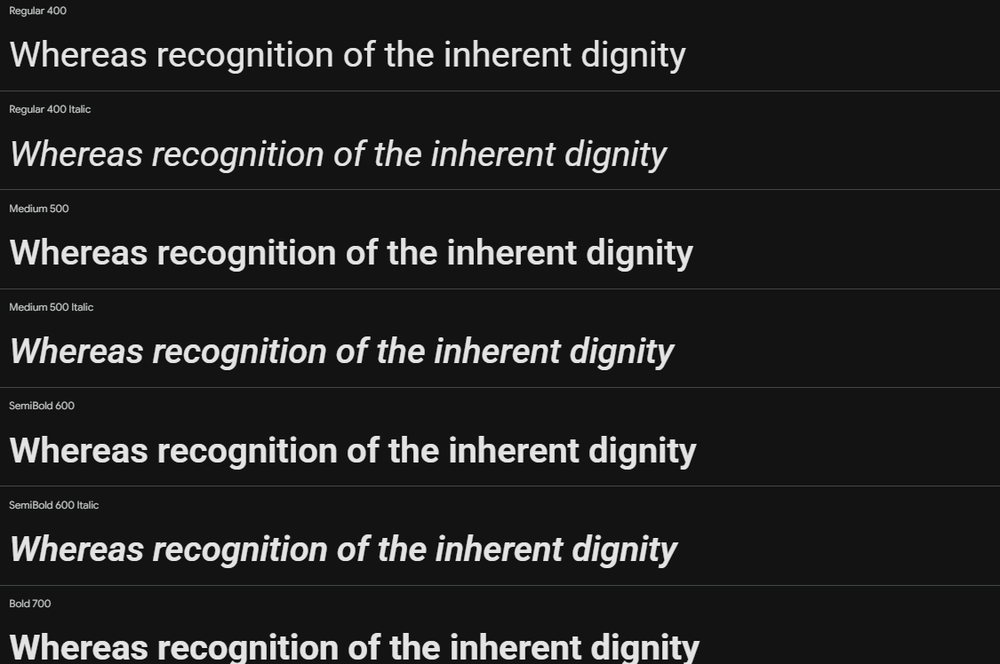

# Capítulo IV: Product Design
En este capítulo se detallan las decisiones de diseño del producto para su plataforma DoofPlus, junto con la Landing Page. Se establecen guías de estilo visuales, arquitectura de la información (AI) y criterios que aseguran que la experiencia de usuario (UX) sea intuitiva y profesional, donde alineamos a las exigencias en las máquinas de la industria farmacéutica y entidades regulatorias para la calidad de los fármacos como la DIGEMID.

## 4.1. Style Guidelines
En esta sección se establecen las bases visuales y de comunicación para DoofPlus, centralizando los recursos que serán de uso común para todo el equipo de desarrollo y diseño. El objetivo es garantizar una presentación consistente, inclusiva y enfocada a través de todos los puntos de contacto del producto, facilitando la mantenibilidad y escalabilidad del código y del diseño a lo largo del ciclo de vida del proyecto.

### 4.1.1. General Style Guidelines
Para asegurar una interfaz coherente y alineada a los estándares que exige la industria farmacéutica, el sistema de diseño de DoofPlus toma como base fundamental **Material Design**. Esta decisión permite una integración nativa con la biblioteca de componentes Angular Material, que será utilizada en la implementación del frontend.

#### Branding:
El logotico escogido para DoofPlus comunica de forma directa y sintética la propuesta de valor del sistema: la integración de la automatización industrial con la rigurosidad del control farmacéutico. Para la sección de Branding, el análisis de los componentes de dicho logotipo se desglosa de la siguiente manera:
 

 
- Maquinaria y Cinta Transportadora: La silueta industrial con cápsulas en la cinta representa el núcleo operativo de la plataforma, lo que simboliza la manufactura y conexión de IoT en la línea de producción.
- Escudo de Verificación: Representa el Aseguramiento de Calidad de los productos. Transmite bioseguridad, protección de los datos y el cumplimiento regulatorio estricto que se exige por DIGEMID y las BPM.
- Construcción Tipográfica y Cromática: El nombre "DoofPLus" divide sus conceptos visualmente utilizando una fuente sans-serif sólida. El prefijo "Doof" en azul marino corporativo evoca la base tecnológica y la seriedad farmacéutica, mientras que el sufijo "PLus" en verde esmeralda conecta con la salud y la validación de procesos.

#### Typography
La tipografía del logotipo "DoofPLus" se basa en una estructura sans-serif geométrica de peso ExtraBold. 
Esta elección no es casual: sus trazos gruesos y caracteres circulares perfectos proyectan una imagen de exactitud matemática, precisión de datos industriales y solidez algorítmica, características fundamentales para un sistema de telemetría y calidad.

Para la interfaz de la plataforma web y móvil (UI), se empleará Roboto, la fuente estándar de Material Design, en sus variantes Regular (400), Medium (500) y Bold (700). Al ser una fuente diseñada específicamente para la legibilidad en pantallas de alta densidad, garantiza que las extensas tablas de lotes y gráficos de telemetría sean fácilmente interpretables en las pantallas de la planta o dispositivos móviles.

### 4.1.2. Web Style Guidelines

## 4.2. Information Architecture

### 4.2.1. Organization Systems

### 4.2.2. Labeling Systems

### 4.2.3. SEO Tags and Meta Tags

### 4.2.4. Searching Systems

### 4.2.5. Navigation Systems

## 4.3. Landing Page UI Design

### 4.3.1. Landing Page Wireframe

### 4.3.2. Landing Page Mock-up

## 4.4. Web Applications UX/UI Design

### 4.4.1. Web Applications Wireframes

### 4.4.2. Web Applications Wireflow Diagrams

### 4.4.3. Web Applications Mock-ups

### 4.4.4. Web Applications User Flow Diagrams

## 4.5. Web Applications Prototyping

## 4.6. Domain-Driven Software Architecture

### 4.6.1. Design-Level Event Storming

### 4.6.2. Software Architecture Context Diagram

### 4.6.3. Software Architecture Container Diagrams

### 4.6.4. Software Architecture Components Diagrams

## 4.7. Software Object-Oriented Design

### 4.7.1. Class Diagrams

## 4.8. Database Design

### 4.8.1. Database Diagrams