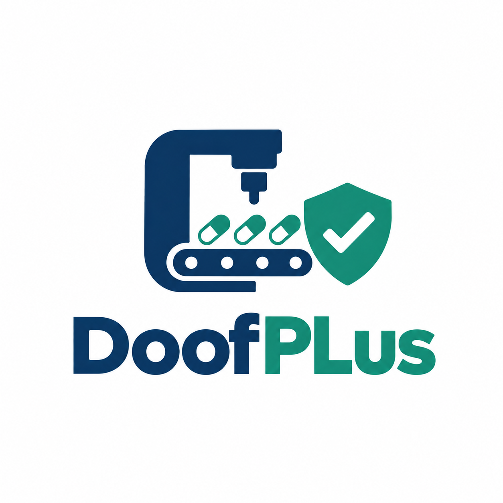

# Capítulo IV: Product Design

## 4.1. Style Guidelines

### 4.1.1. General Style Guidelines

El diseño visual de **DoofPlus** se rige por una estética limpia, técnica y de alta precisión, reflejando el compromiso de **IngesCompany** con la integridad de datos en la manufactura farmacéutica. El objetivo es proyectar un entorno de confianza y profesionalismo que minimice la carga cognitiva del usuario al gestionar documentación de calidad, trazabilidad de lotes y cumplimiento regulatorio.

**Branding**

El logotipo de DoofPlus combina elementos que representan los pilares de la plataforma: calidad farmacéutica, trazabilidad y tecnología IoT. El nombre "DoofPlus" comunica la idea de ir más allá (+) en la gestión documental y operativa del sector farmacéutico. El branding transmite innovación, rigor y confiabilidad, valores esenciales para los laboratorios que confían en la plataforma el cumplimiento de sus normativas BPM y DIGEMID.

**Typography**

La tipografía empleada es **Inter**, con sus variantes Regular, Medium, SemiBold y Bold. Se eligió Inter por su excelente legibilidad en datos numéricos y tablas extensas, característica crítica para un entorno donde los usuarios revisan expedientes de lotes, resultados analíticos y parámetros de producción. Su disponibilidad en Google Fonts asegura carga eficiente en cualquier dispositivo.

Jerarquía tipográfica:

- **H1 (Títulos principales):** 2.5rem (40px) en escritorio, 2rem (32px) en móvil.
- **H2 (Subtítulos):** 2rem (32px) en escritorio, 1.75rem (28px) en móvil.
- **H3/H4 (Títulos de componentes):** 1.5rem (24px) a 1.25rem (20px).
- **Cuerpo (p):** 1rem (16px) con interlineado de 1.6.
- **Botones y etiquetas:** 0.875rem (14px) a 1.125rem (18px).

Se mantiene un ratio de contraste mínimo de 4.5:1 (WCAG 2.1 AA) para garantizar accesibilidad en entornos de laboratorio y oficina.

**Colors**

La paleta fue seleccionada para transmitir pulcritud, control y profesionalismo técnico:

**Paleta principal:**
- **Primario (Teal DoofPlus):** `#0D9488` — Identidad principal, botones de acción y enlaces activos.
- **Secundario (Azul Pizarra Oscuro):** `#0F172A` — Texto principal, headers y barras de navegación.
- **Terciario (Gris Pizarra):** `#64748B` — Texto secundario, etiquetas y descripciones.
- **Fondo Claro:** `#F8FAFC` — Fondos de secciones alternas.
- **Blanco:** `#FFFFFF` — Fondos de tarjetas y contenido principal.

**Colores funcionales:**
- **Éxito:** `#22C55E` — Lotes aprobados, acciones exitosas.
- **Error:** `#EF4444` — Desviaciones críticas, alertas de rechazo.
- **Advertencia:** `#F59E0B` — Calibraciones vencidas, notificaciones.
- **Info:** `#3B82F6` — Mensajes informativos y tooltips.

Esta combinación transmite rigor científico, seguridad y trazabilidad, valores clave para laboratorios y entidades regulatorias como DIGEMID.

**Spacing**

El espaciado sigue un sistema modular basado en múltiplos de 8px para mantener consistencia y ritmo visual:

- **Unidad base:** 8px (0.5rem). Todos los espaciados son múltiplos de esta unidad.
- **Padding de secciones:** 64px (4rem) vertical para separación entre bloques principales.
- **Gap entre tarjetas/elementos:** 24px (1.5rem) a 32px (2rem).
- **Padding interno de cards:** 24px (1.5rem).
- **Line-height del texto:** 1.6 para legibilidad óptima en párrafos de documentación.

**Tono de Comunicación**

| Dimensión | Posición | Justificación |
|---|---|---|
| Divertido ↔ Serio | **Serio (80%)** | Industria farmacéutica regulada; los usuarios necesitan precisión y confianza. |
| Formal ↔ Casual | **Formal (75%)** | Comunicación orientada a profesionales de QA/QC y Jefes de Producción. |
| Respetuoso ↔ Irreverente | **Respetuoso (90%)** | Contexto regulatorio donde la credibilidad es fundamental. |
| Entusiasta ↔ Sereno | **Sereno (70%)** | Prioriza claridad y calma; entusiasmo reservado para CTAs y logros. |

El lenguaje es **técnico y directo**, sin evitar terminología del sector (BPM, DIGEMID, trazabilidad, lote), ya que los usuarios la manejan a diario. Se enfoca en los beneficios operativos: reducción de errores, automatización de reportes y trazabilidad inmediata.

### 4.1.2. Web Style Guidelines

Las directrices web de DoofPlus se centran en la eficiencia operativa, la legibilidad de datos y la consistencia visual en todos los dispositivos.

**1) Layout**

- **Grid:** Sistema de 12 columnas con breakpoints en 768px (tablet) y 1024px (desktop). El contenido principal se contiene en un `max-width` de 1200px con centrado automático.
- **Header:** Fijo en la parte superior con navegación principal, logo y accesos (Sign In / Sign Up). Fondo `#0F172A` con texto claro para máximo contraste.
- **Footer:** Contiene enlaces de soporte, contacto, redes sociales y suscripción a actualizaciones.
- **Cards:** Bordes redondeados (8px), sombra sutil (`0 2px 8px rgba(0,0,0,0.08)`) y padding interno de 24px. Se usan para agrupar módulos, planes y métricas.

**2) Responsive Design**

- **Desktop (≥1024px):** Navegación completa visible. Contenido en múltiples columnas. Tablas de datos y dashboards aprovechan el ancho completo.
- **Tablet (768px–1023px):** Navegación colapsada en menú hamburguesa. Grid de 2 columnas. Botones y campos expandidos para interacción táctil.
- **Mobile (<768px):** Layout de 1 columna. Menú desplegable. Elementos interactivos de tamaño mínimo 44×44px para accesibilidad táctil.

**3) Interaction Design**

- **Botones primarios:** Fondo teal (`#0D9488`), texto blanco, hover con oscurecimiento al 10%. Border-radius de 6px.
- **Botones secundarios:** Borde teal, fondo transparente, texto teal. Hover con fondo teal al 10% de opacidad.
- **Formularios:** Campos con borde `#CBD5E1`, focus con borde teal y sombra outline. Validación inline sin recarga de página. Labels siempre visibles encima del campo.

**4) Images and Icons**

- **Imágenes:** Fotografías profesionales de entornos farmacéuticos (laboratorios, líneas de producción). Optimizadas en formato WebP con fallback a PNG/JPG.
- **Íconos:** Estilo lineal y minimalista (ej. Lucide Icons o Heroicons). Tamaño base de 24px. Representan conceptos clave: trazabilidad (ruta), lote (caja), calidad (escudo), IoT (señal), auditoría (documento).

**5) Repositorio Central**

- **Estructura de assets:**
    - `assets/img/` — Imágenes organizadas por capítulo/sección.
    - `assets/fonts/` — Tipografías locales (fallback).
    - `assets/styles/` — Hojas de estilo CSS.
    - `assets/scripts/` — JavaScript interactivo.
- **Versionado:** Git con convención de commits `docs:`, `feat:`, `fix:`. Ramas por feature (`feature/chapter4`, etc.).

## 4.2. Information Architecture

La arquitectura de la información de **DoofPlus** está diseñada para que tanto los visitantes de la Landing Page como los usuarios de la aplicación web (Especialistas QA/QC y Jefes de Producción) encuentren la información que necesitan sin esfuerzo, aplicando principios de organización jerárquica, etiquetado claro y navegación contextual.

### 4.2.1. Organization Systems

**Landing Page — Organización jerárquica (Visual Hierarchy):**
La página de inicio presenta la información de lo general a lo específico, guiando al visitante desde la propuesta de valor hasta la conversión:

- **Hero:** Mensaje principal de DoofPlus, problema que resuelve y CTA hacia la demo.
- **Features:** Desglose de los módulos clave (Trazabilidad de Lotes, Control de Calidad, IoT, Auditoría).
- **Benefits:** Ventajas competitivas como la eliminación de registros manuales y la trazabilidad inmutable.
- **Plans:** Opciones de suscripción con desglose de características por plan.
- **Testimonials:** Casos de éxito y reseñas del sector farmacéutico.
- **FAQ:** Preguntas frecuentes sobre instalación, compatibilidad IoT y soporte.
- **Contact:** Formulario de solicitud de demostración.

**Web Application — Organización matricial y secuencial:**
Dentro de la plataforma, el contenido se organiza según dos esquemas:

- **Matricial (por tópicos):** El menú lateral agrupa las funcionalidades por dominio de negocio: *Lotes*, *Protocolos*, *Desviaciones*, *Telemetría IoT*, *Auditoría*, *Catálogo de Productos*. Cada usuario accede a las secciones relevantes según su rol.
- **Secuencial (step-by-step):** Los flujos críticos como la apertura de un lote o el registro de una desviación siguen un proceso guiado paso a paso, asegurando que no se omitan campos obligatorios ni validaciones regulatorias.
- **Cronológico:** El historial de trazabilidad (Audit Trail) y las lecturas de telemetría se presentan en orden cronológico descendente, priorizando los eventos más recientes.

### 4.2.2. Labeling Systems

Se utiliza un sistema de etiquetas concisas y consistentes, alineadas al lenguaje ubicuo del dominio farmacéutico:

**Landing Page:**

| Etiqueta | Asociación |
|---|---|
| Features | Módulos y capacidades técnicas de la plataforma |
| Plans | Opciones de suscripción y precios |
| FAQ | Respuestas a dudas frecuentes de implementación |
| Request a Demo | Formulario de contacto comercial |
| Sign In / Sign Up | Acceso y registro a la plataforma |

**Web Application:**

| Etiqueta | Asociación |
|---|---|
| Batches | Gestión y trazabilidad de lotes de producción |
| Protocols | Protocolos de calidad y documentación normativa |
| Deviations | Registro de no conformidades y acciones correctivas |
| Telemetry | Lecturas de sensores IoT en tiempo real |
| Audit Trail | Historial inmutable de cambios en el sistema |
| Dashboard | Panel de indicadores y métricas de cumplimiento |
| Catalog | Productos farmacéuticos y fórmulas maestras |

Se evitan sinónimos o variaciones para una misma funcionalidad. Por ejemplo, "Batches" se usa consistentemente en la navegación, los breadcrumbs y los títulos de página.

### 4.2.3. SEO Tags and Meta Tags

**Landing Page (`index.html`):**

| Tag | Valor |
|---|---|
| Title | DoofPlus · Trazabilidad y Control de Calidad Farmacéutica |
| Meta Description | Plataforma web para gestión de calidad, trazabilidad de lotes e integración IoT en la industria farmacéutica. Cumplimiento BPM y DIGEMID. |
| Meta Keywords | trazabilidad farmacéutica, control de calidad, BPM, DIGEMID, IoT manufactura, gestión de lotes, DoofPlus |
| Meta Author | IngesCompany |

**Web Application (`/app`):**

| Tag | Valor |
|---|---|
| Title | DoofPlus · Dashboard |
| Meta Description | Panel de gestión de calidad farmacéutica: monitoreo de lotes, desviaciones, telemetría IoT y cumplimiento regulatorio. |
| Meta Keywords | dashboard farmacéutico, trazabilidad lotes, control calidad, audit trail, DoofPlus app |
| Meta Author | IngesCompany |

Cada sub-página de la aplicación actualiza dinámicamente el `<title>` para reflejar la sección activa (ej. "DoofPlus · Batches", "DoofPlus · Deviations").

### 4.2.4. Searching Systems

**Landing Page:**
La Landing Page no requiere buscador global. La sección FAQ incluye un filtro por categorías (Instalación, IoT, Soporte, Precios) que permite al visitante localizar respuestas sin recorrer todo el listado.

**Web Application:**
- **Barra de búsqueda global:** Ubicada en el header de la app, permite buscar por **código de lote**, **nombre de producto** o **ID de desviación**. Los resultados se muestran agrupados por tipo de entidad (Lote, Protocolo, Desviación).
- **Filtros contextuales:** Cada vista de listado cuenta con filtros específicos:
  - *Lotes:* por estado (En Proceso, Aprobado, Rechazado, Retenido), rango de fechas y producto asociado.
  - *Desviaciones:* por severidad (Crítica, Mayor, Menor), estado (Abierta, En Investigación, Cerrada) y lote afectado.
  - *Telemetría:* por dispositivo IoT, parámetro medido y rango de valores.
- **Visualización de resultados:** Los resultados se presentan en tablas paginadas con columnas ordenables. Cuando no hay coincidencias, se muestra el mensaje "No se encontraron resultados" con sugerencias de ajuste de filtros.

### 4.2.5. Navigation Systems

**Landing Page — Navegación lineal y contextual:**
- **Navbar fijo:** Barra superior con enlaces ancla a las secciones principales (*Features, Plans, FAQ, Contact*) y botones de acceso (*Sign In, Sign Up*). Permanece visible al hacer scroll.
- **CTAs contextuales:** Botones estratégicos dentro de cada sección que guían al visitante al siguiente paso lógico (ej. de *Features* a *Plans*, de *Plans* a *Request a Demo*).
- **Footer:** Enlaces secundarios de soporte, políticas y redes sociales.

**Web Application — Navegación lateral y breadcrumbs:**
- **Sidebar fijo:** Menú lateral con iconos y etiquetas para cada módulo (*Dashboard, Batches, Protocols, Deviations, Telemetry, Catalog, Audit Trail*). Se colapsa a solo iconos en resoluciones menores.
- **Breadcrumbs:** Ruta jerárquica visible en la parte superior de cada vista (ej. *Dashboard > Batches > LOT-2026-0142*), permitiendo retroceder a cualquier nivel sin perder contexto.
- **Tabs contextuales:** Dentro de la vista de detalle de un lote, se utilizan pestañas para agrupar información relacionada (*General, Muestras, Desviaciones, Telemetría, Audit Trail*).

## 4.3. Landing Page UI Design

### 4.3.1. Landing Page Wireframe

### 4.3.2. Landing Page Mock-up

## 4.4. Web Applications UX/UI Design

### 4.4.1. Web Applications Wireframes

### 4.4.2. Web Applications Wireflow Diagrams

### 4.4.3. Web Applications Mock-ups

### 4.4.4. Web Applications User Flow Diagrams

## 4.5. Web Applications Prototyping

## 4.6. Domain-Driven Software Architecture

### 4.6.1. Design-Level Event Storming

### 4.6.2. Software Architecture Context Diagram

### 4.6.3. Software Architecture Container Diagrams

### 4.6.4. Software Architecture Components Diagrams

## 4.7. Software Object-Oriented Design

### 4.7.1. Class Diagrams

## 4.8. Database Design

### 4.8.1. Database Diagrams